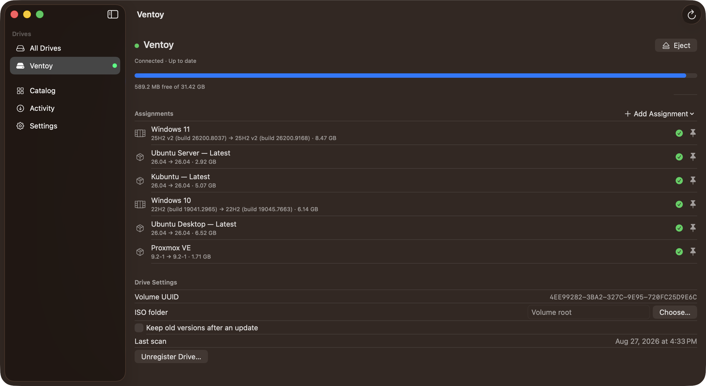
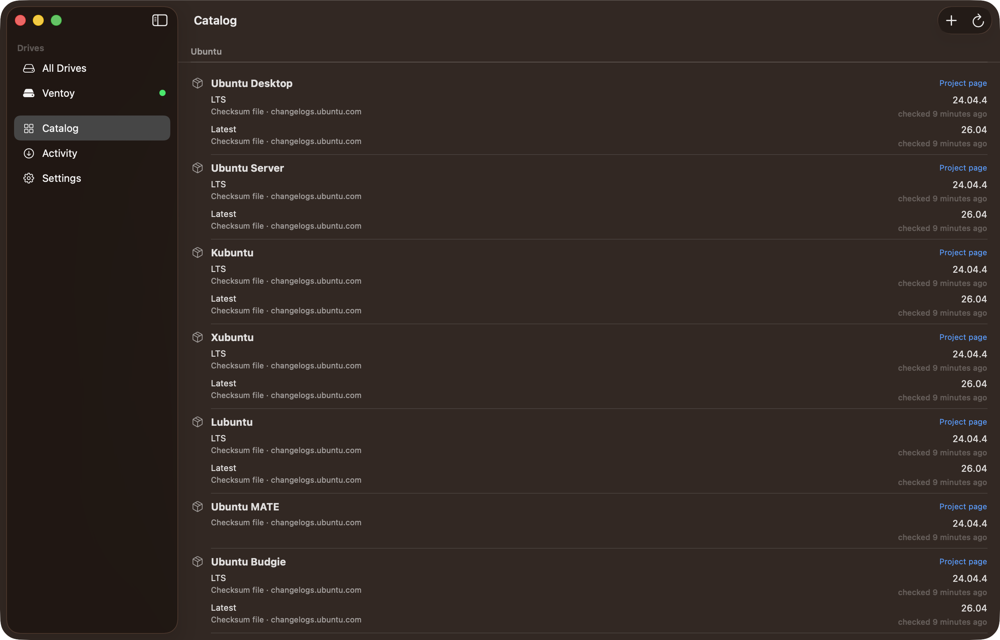
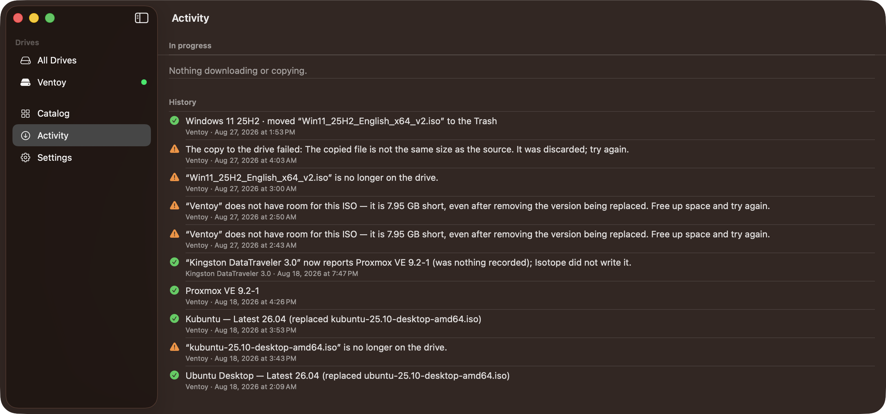
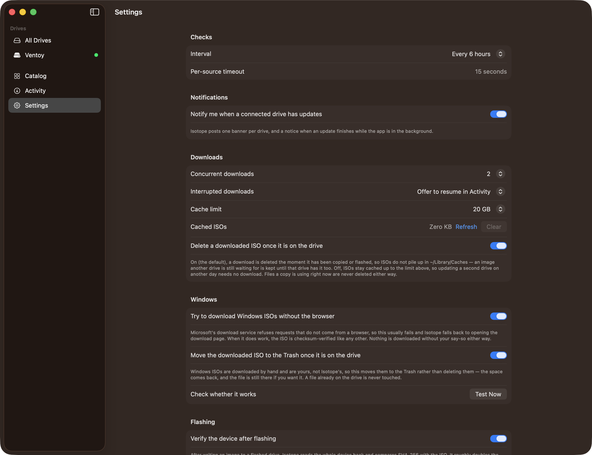

# Isotope

**Alpha.** The shape is settled and the internals are covered by tests, but this has had one pair of eyes on it, ships no notarised build, and its catalog is only as current as the last `verify-catalog.sh` run. Read [Alpha status](#alpha-status) before pointing it at a drive you care about.

A native macOS app that keeps the ISOs on your USB drives up to date.

Isotope tracks which operating systems live on which of your USB sticks, notices when new releases ship, and downloads, verifies and installs them once you confirm. It handles Ventoy drives, where updating means replacing `.iso` files, and flashed drives, where updating means re-imaging the whole device, balenaEtcher-style.

Requires macOS 14 or later. Universal binary (Apple Silicon + Intel). No third-party dependencies.



*A registered Ventoy drive. Each row shows what is on the stick, what is available, and how big it is.*

---

## What it tracks

56 operating systems across 106 channels, grouped by organization:

| | |
|---|---|
| **Ubuntu** | Ubuntu Desktop, Ubuntu Server, Kubuntu, Xubuntu, Lubuntu, Ubuntu MATE, Ubuntu Budgie, Ubuntu Studio, Ubuntu Cinnamon, Ubuntu Unity, Ubuntu Kylin, Edubuntu (LTS + Latest channels) |
| **Debian family** | Debian (netinst + DVD), Debian Live (6 desktops), Linux Mint Cinnamon/MATE/Xfce, LMDE, Pop!_OS (Intel + NVIDIA), Kali Linux (installer, netinst, live, everything, purple), MX Linux (Xfce, KDE, Fluxbox), Parrot OS |
| **Fedora** | Workstation, KDE Plasma, Server (DVD + netinst), Everything, Silverblue, Kinoite, and a Spins entry covering Xfce, Cinnamon, MATE, LXQt, LXDE, Sway, Budgie, i3 and COSMIC |
| **Enterprise** | Rocky Linux, AlmaLinux (Minimal/DVD/Boot), CentOS Stream (DVD + Boot), Proxmox VE, Proxmox Backup Server, Proxmox Mail Gateway, Proxmox Datacenter Manager |
| **Arch family** | Arch Linux, Manjaro (KDE, GNOME, Xfce), CachyOS (desktop + handheld) |
| **Independents** | openSUSE Leap, openSUSE Tumbleweed, NixOS (graphical + minimal), Alpine (standard, extended, virt), Void Linux (glibc + musl), Gentoo (minimal + LiveGUI), Qubes OS |
| **BSD & storage** | FreeBSD (disc1 + DVD), GhostBSD, TrueNAS |
| **Tools & rescue** | SystemRescue, GParted Live, Clonezilla Live, Memtest86+, Tails |
| **Microsoft** | Windows 11, Windows 10 (tracked by feature release, media revision and exact build, see below; download is browser-assisted) |

An entry ships only when its version can be resolved from a stable machine-readable source and the publisher publishes a SHA-256 Isotope can parse. That rule is why some popular distributions are missing: EndeavourOS and ShredOS publish SHA-512/SHA-1 only, Zorin OS and elementary OS put their downloads behind scripts rather than links, Devuan and Deepin ship no parsable sums file, XCP-ng publishes no checksums beside its ISOs. Each of those is one `catalog.json` entry away the moment that changes.

Anything not in the catalog can be added as a custom source. There are four detection mechanisms, each with a live "Test" button so you can see exactly what it parses before saving.



*The catalog, grouped by organization. Every channel names the source it was resolved from and when it was last checked.*

## Keeping updates safe

- Every ISO is SHA-256 verified against the publisher's checksum before it touches a drive. Sources without a published checksum are labelled unverified rather than silently trusted.
- Copies land under a temporary name and are renamed on completion, so a half-written ISO never appears on your drive.
- Only the specific old ISO being replaced is ever deleted. Nothing else on the drive is touched.
- The free-space pre-flight counts the ISO being replaced, including one that shares the incoming file's name, and fails with the exact shortfall rather than running out mid-copy.
- Updates always require explicit confirmation. Nothing is ever flashed or replaced automatically.
- Downloaded ISOs are deleted as soon as they are on the drive (on by default). The cache is there to save a second download, not to keep a second copy of what you are already carrying on a stick. An image another queued drive still needs is kept until that drive has it too, and a failed copy keeps its download for the retry.



*Activity records every download, copy and flash. Failures stay in the history with the reason they failed.*

## The awkward cases

- **Windows.** Microsoft's links are session-generated, so its ISOs can't be hotlinked. Isotope tracks the current feature release, opens the official download page, then verifies and places the file you downloaded. Once it is on the drive the download is moved to the Trash by default. It is your file, so it stays recoverable.
- **Windows media identity.** A filename is not enough. Isotope asks Microsoft which revision of a release is currently being served, and reads the exact build out of the image itself. Rows read *25H2 (build 26200.6584) → 25H2 v2 (build 26200.9168)* instead of *25H2 → 25H2*.
- **Memtest86+.** It ships only a zipped ISO upstream, so Isotope unzips it before placing.
- **Genuinely unknown versions.** Where a version can't be determined, the app says "unknown" instead of guessing.

---

## Drive types

### Ventoy drives

Register a mounted Ventoy volume, assign the ISOs you want tracked, and Isotope replaces them in place as new releases ship. It identifies drives by volume UUID and warns if a registered drive is reformatted.

ISOs already sitting on the drive are matched against the catalog and offered under "Found on this drive", one click to start tracking one, or to pin it. Files it can't identify are listed, and Isotope never changes them on its own. Every ISO shows its size, so it is clear where a full stick went.

To get rid of an ISO, remove its assignment and choose **Remove and Delete ISO**, or **Stop Tracking, Keep File** to leave it on the stick. Untracked and unrecognised files can be deleted from their right-click menu. Deletes are permanent rather than to the Trash, because on a USB stick the Trash keeps the space in use. The eject button sits on the drive's sidebar row, as in Finder.

### Flashed drives

Register a physical USB device (identified by USB vendor/product/serial, since flashing destroys the volume identity), assign one image, and Isotope re-images the whole device when a new release ships.

Flashing runs a safety gate every time. The device must be external, removable, USB-attached, not the boot disk, and large enough. It then requires a confirmation naming the exact device before macOS prompts for your administrator password via Apple's `authopen`. No root daemon is installed and no privileges are stored; every flash re-prompts. After writing, the device is read back and hash-compared by default.

To identify what's already on a flashed stick, Isotope reads its volume label and, where available, a small marker file such as `/.disk/info`. No admin rights, no raw reads.

---

## Pinning: choosing what updates

Every assignment has an update policy. **Track latest** is the default: it counts toward staleness and gets update prompts. **Keep as is** pins the assignment, which is never counted as stale, never updated, and whose file is never touched.

Because of this, one Ventoy drive can hold several versions of the same OS: one tracking the latest release, plus any number pinned. When you confirm an update, each item offers *"Keep current version on the drive as a pinned copy"*. Instead of deleting the outgoing ISO, it becomes its own pinned assignment. That's the intended way to accumulate versions deliberately.

---

## Windows: release, revision, build

Windows is the one entry where the filename does not identify the file. Microsoft names every 25H2 ISO `Win11_25H2_English_x64.iso`, and reissues it under almost that same name, so two sticks with near-identical filenames can hold months of difference.

Isotope pins it down with three things, in order of how much they matter:

- **Feature release.** 25H2, 24H2, 22H2. The identity that means something across media, and the first thing compared.
- **Media revision.** Microsoft reissues a release as `25H2__V2`, and their filenames say so (`…_x64v2.iso`, the original having no suffix). Isotope asks Microsoft's download connector what it is serving right now, one plain GET with no login, and compares it against what your ISO's name claims. A newer revision is a real update, because unlike a build, it can actually be downloaded today.
- **Build.** 26200.6584, read out of `sources/install.wim` by mounting the ISO read-only, with no administrator rights and no writes. Compared only once release and revision match, and shown as "Newer build shipped" rather than an update. Microsoft services Windows monthly but reissues the ISO rarely, so counting it would send you to fetch the file you already have. The button is still there if you want to fetch it anyway, and the sheet tells you what you will actually get.

A row therefore reads *25H2 (build 26200.6584) → 25H2 v2 (build 26200.9168)*, and you can tell at a glance which part of that you can do something about. An image that will not identify itself simply shows less; nothing is inferred from a filename Microsoft did not write.

### Can it download Windows automatically?

Partly. Microsoft's download service has two relevant endpoints. The one that reports what is being served answers anybody, and that is what the revision tracking above uses. The one that mints a download link is behind an anti-automation check that replies `"Sentinel marked this request as rejected"` to anything that is not a browser session. It refused correctly-formed requests from an ordinary home connection during development, which is why Rufus's Fido script fails for so many people too.

So there is a setting, **Try to download Windows ISOs without the browser**, off by default, that attempts it anyway and tells you which of the two things happened. When Microsoft answers, the link comes with its SHA-256 and the ISO is downloaded, verified and placed like any other. When it refuses, you see their own words for it, and the normal three-click hand-off is right there. Nothing is downloaded without your say-so either way.

Next to that setting is **Test Now**, which runs the real attempt and reports the outcome: answered, refused (quoting Microsoft), or could not be tried. It works with the setting off, because that is the question you want answered before turning it on.

If you keep your own mirror, a custom source pointing at your ISO plus its checksum makes Windows behave exactly like every Linux entry. That path has always been open.

---

## Building and installing

Requires Xcode and [XcodeGen](https://github.com/yonaskolb/XcodeGen) (`brew install xcodegen`). The Xcode project is generated from `project.yml`, so edit that, not the `.xcodeproj`.

```sh
xcodegen generate
xcodebuild -project Isotope.xcodeproj -scheme Isotope -configuration Release build
```

Then copy the built app into `/Applications`:

```sh
APP=$(xcodebuild -project Isotope.xcodeproj -scheme Isotope -configuration Release \
      -showBuildSettings | awk '/ BUILT_PRODUCTS_DIR =/{print $3}')/Isotope.app
ditto "$APP" /Applications/Isotope.app
```

Or just open `Isotope.xcodeproj` in Xcode and run.

The app is not sandboxed, because raw device access for flashing is incompatible with the App Sandbox. A source build is signed ad-hoc, so it needs nobody's certificate. `Scripts/release.sh` builds the maintainer's release instead: signed with Developer ID, notarized when a `notarytool` profile is stored, and installed to `/Applications`. Distribution is from source or via Developer ID, not the App Store.

### Tests

```sh
swift test --package-path IsotopeCore     # portable logic
xcodebuild -project Isotope.xcodeproj -scheme Isotope test   # app layer
```

Everything runs offline against fixtures. No network, no USB device, no admin rights required.

### Checking the catalog against the live internet

```sh
./Scripts/verify-catalog.sh
```

Resolves every entry against its real source and prints the version, ISO URL, and checksum status. Run this after editing `catalog.json`, or whenever you suspect a distro changed its layout.

---

## Project layout

```
IsotopeCore/          Swift package, platform-agnostic, Foundation only
  Models/             Data model: catalog, drives, versions, policies
  Providers/          Version detection (checksum files, JSON feeds, scraping…)
  *.swift             Reconcile, staleness, safety gates, cache index, matchers
Isotope/              macOS app
  Services/           Downloads, updates, flashing, device enumeration, probes
  Stores/             AppStore (observable state) + settings
  Views/              SwiftUI
  Resources/          catalog.json, the built-in OS catalog
IsotopeTests/         App-layer tests
Scripts/              verify-catalog.sh, make-app-icon.swift
docs/                 BRD, PRD, technical design
```

`IsotopeCore` depends on Foundation alone. No SwiftUI, AppKit, CryptoKit, or DiskArbitration. Hashing sits behind a protocol the app fills in with CryptoKit. That keeps all of the app's decision-making portable, so a future Linux version can reuse it and rewrite only the UI and platform glue.

The catalog is data, not code. Distros change their URL layouts; when that happens the fix is an edit to `catalog.json` and a run of `verify-catalog.sh`, not a recompile.

---

## Where things live at runtime

| Path | Contents |
|---|---|
| `~/Library/Application Support/Isotope/` | `drives.json`, `custom-sources.json`, `release-cache.json`, `history.json` |
| `~/Library/Caches/Isotope/` | Downloaded ISOs in `isos/`, plus `cache-index.json` and interrupted-download resume data |

All state is human-readable JSON.

The cache does not accumulate. By default an ISO is deleted the moment it has been copied or flashed, so `~/Library/Caches/Isotope/` stays near empty between updates; what remains is interrupted downloads and anything still in use. Turn *Delete a downloaded ISO once it is on the drive* off in Settings and ISOs are kept instead, up to the cache limit (20 GB by default, LRU, clearable in Settings). That is worth it if the same image goes onto several drives on different days, since the second drive then needs no download.



*Settings. Every option that changes what touches your disk explains itself in place.*

No telemetry. The app talks only to the ISO sources in the catalog, their checksum files, and the GitHub API for entries that use it.

---

## Alpha status

Alpha means the shape is settled and the guts are tested. 253 unit tests in `IsotopeCore`, 226 in the app layer, all offline. What it has not been through is anyone else's hands or anyone else's hardware.

What that means in practice:

- **Flashing erases a whole device.** The safety gates and the naming confirmation are real and tested, but the consequence of a bug here is somebody's disk. Read the device name in the confirmation dialog every time.
- **The catalog is only as fresh as the last verification run.** Distributions move their URLs without warning. Every entry was live-verified on 2026-08-20; if a source drifts, checks report a failure for that channel rather than a wrong version, and the fix is a `catalog.json` edit plus `Scripts/verify-catalog.sh`.
- **There is no published notarised build yet.** Build from source; source builds are signed ad-hoc.
- **No migration promises yet.** State is human-readable JSON under `~/Library/Application Support/Isotope/`, and unknown fields are tolerated, but nothing here is a stability guarantee.
- **Windows build detection has been exercised against synthetic images and real media on one machine.** Unusual media, custom or repacked ISOs, may simply report no build.

The most useful bug report names the drive type, the entry, and what the row said versus what was actually on the stick.

---

## Documentation

`docs/` holds the full specification: [BRD.md](docs/BRD.md) (scope and rationale), [PRD.md](docs/PRD.md) (numbered requirements, including every addendum), and [DESIGN.md](docs/DESIGN.md) (architecture and technical decisions).
